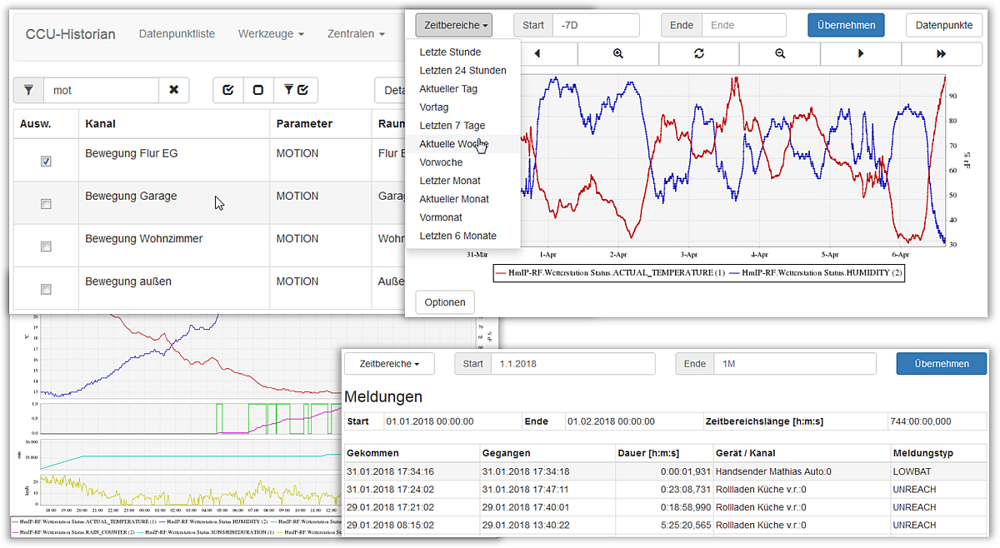
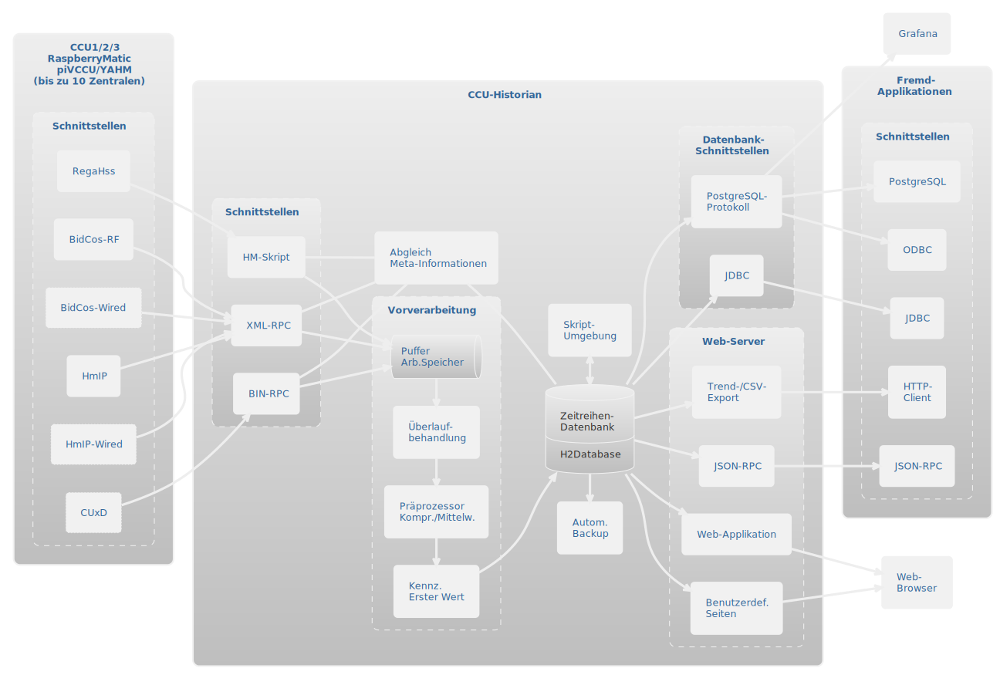

# CCU-Historian

Langzeitarchiv für die Zentrale (CCU) des Hausautomations-Systems HomeMatic

Der CCU-Historian ist ein Langzeitarchiv für die Zentrale (CCU) des [Hausautomations-Systems](http://de.wikipedia.org/wiki/Hausautomation) HomeMatic der Firma [eQ-3](http://www.eq-3.de/).

Die Kommunikationsvorgänge der CCU-Schnittstellen (BidCos-RF, BidCos-Wired und System) werden aufgezeichnet. Darunter befinden sich z.B. die Messwerte aller Sensoren und alle ausgeführten Schaltvorgänge. Aus der Logikschicht der CCU werden zusätzlich die Systemvariablen archiviert. Die gesammelten Daten werden strukturiert in einer Datenbank abgelegt und stehen daraufhin für Visualisierungen oder Analysen zur Verfügung. Für einen ersten Überblick werden Web-Seiten mit Trend-Diagrammen durch einen eingebetteten Web-Server generiert.

Der CCU-Historian erfreut sich bei den HomeMatic-Anwendern einer großen Beliebtheit und verfügt über eine breite Installationsbasis.

Viele weitere Informationen sind auf der [offiziellen Web-Seite des CCU-Historians](http://www.ccu-historian.de/) und im [umfangreichen Handbuch](https://github.com/mdzio/ccu-historian/wiki) zu finden.

# Übersicht

Das folgende Diagramm zeigt die einzelnen Komponenten des CCU-Historians:

# Unterstützte Plattformen

Da der CCU-Historian nur eine [Java-Laufzeitumgebung](https://java.com/) zum Betrieb voraus setzt, ist er auf etlichen Hard- und Software-Plattformen lauffähig: 

* Windows / Linux / MacOS 
* x86 / x64 / ARM

Für bestimmte Systeme existieren fertige Installationspakete:

* CCU-Addon für folgende HomeMatic-Zentralen:
  * CCU3 (Die neue Zentrale erscheint Q3 2018.)
  * [RaspberryMatic](https://github.com/jens-maus/RaspberryMatic)
  * [piVCCU](https://github.com/alexreinert/piVCCU)
  * [YAHM](https://github.com/leonsio/YAHM)
* Synology-Paket

**Hinweis:** Durch die geringen CPU- und RAM-Ressourcen einer CCU2 wird die Installation als CCU-Addon auf dieser Plattform nicht unterstützt. Es wird daher empfohlen den CCU-Historian auf einem weiteren System zu installieren und so zu konfigurieren, dass er sich über Netzwerk mit der CCU2 verbindet.

# Installation und Konfiguration

Die Installation und Konfiguration ist im [Handbuch](https://github.com/mdzio/ccu-historian/wiki) ausführlich beschrieben. 

# Entwicklungsumgebung

Der CCU-Historian ist größtenteils in der [Programmiersprache Apache Groovy](http://groovy-lang.org) geschrieben. Weitere Programmiersprachen sind Java und JavaScript. Als Entwicklungsumgebung wird [Eclipse Photon](http://www.eclipse.org) in der Variante für Java-Entwickler verwendet. Desweiteren wird das [Groovy-Eclipse-Plugin](https://github.com/groovy/groovy-eclipse/wiki) benötigt. Dafür unter *Help* → *Install New Software* die Update-Site [http://dist.springsource.org/snapshot/GRECLIPSE/e4.8](http://dist.springsource.org/snapshot/GRECLIPSE/e4.8) eintragen. Über *File* → *Import* → *Projects from Git* kann direkt das Repository geklont werden. Die Zielplattform ist Java Version 8.

Alle Beiträge zum Projekt müssen unter die [GNU General Public License V3](LICENSE.txt) gestellt werden. Die Lizenzen von verwendeten Bibliotheken müssen mit dieser kompatibel sein.

# Lizenz und Haftungsausschluss

Dieses Projekt steht unter der [GNU General Public License V3](LICENSE.txt).

# Autoren

Copyright (c) 2011-2018

* Mathias Dzionsko
* Jens Maus (CCU/RaspberryMatic-Distribution)
* Yannick Rocks, Thomas Zahari (Synology-Distribution)
